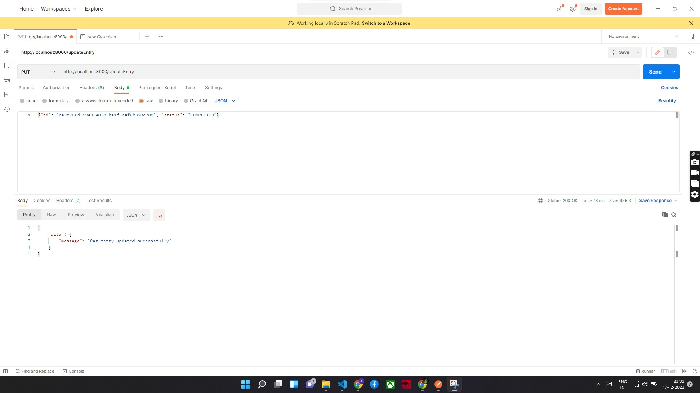
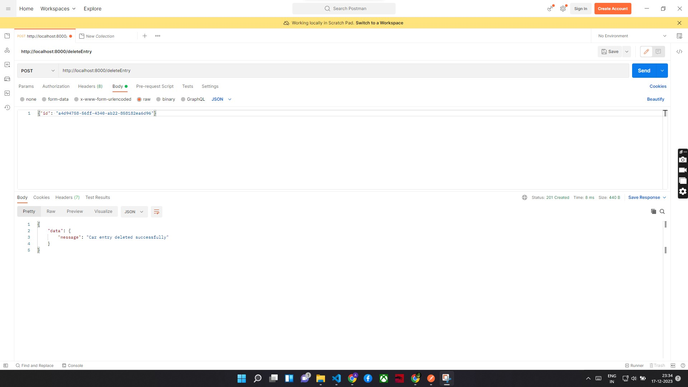

# Car Service Center Application

The Car Service Center Application is a web-based system that allows users to manage and track cars in a service center. It provides functionalities such as adding new cars, updating their status, searching by license plate, and deleting entries.

## Technologies Used

- **Frontend:** React.js
- **Backend:** Gofr (a lightweight HTTP framework for Go)
- **Database:** MongoDB
- **Styling:** CSS

## Table of Contents

- [Introduction](#introduction)
- [Features](#features)
- [Getting Started](#getting-started)
- [API Endpoints](#api-endpoints)
- [Unit Tests](#unit-tests)
- [Bonus Features](#bonus-features)
- [Contributing](#contributing)
- [License](#license)

## Introduction

simple web application for managing a car garage. It utilizes the Go language for server-side programming, the MongoDB database for data storage, and the gofr package for handling HTTP requests and routing. The application includes functionality for user registration, user login, car entry addition, listing cars, updating car entries, and deleting car entries.

### Let's break down the key components and features of the project:
- **MongoDB Integration:** The project integrates with MongoDB, a NoSQL database, for storing data related to users and cars.
Two collections, users and cars, are used to store information about registered users and cars in the garage.
- **User Management:** Users can register by providing a username and password.
Passwords are intended to be hashed before storage, though the sample code assigns a hardcoded hashed value for simplicity.
- **User Authentication:** Users can log in by providing their username and password.
The provided password is compared with the stored hashed password for authentication.
- **Car Management:** Cars can be added to the garage, with details such as license plate, entry time, and status.
The status is initially set to "In Garage."
- **Listing Cars:** The application provides an endpoint to retrieve a list of all cars in the garage.
- **Updating Car Entries:** There's functionality to update the details of a car entry, though the exact requirements for this are not explicitly specified in the provided code.
- **Deleting Car Entries:** Car entries can be deleted from the garage based on the provided car ID.
- **HTTP Server and Routing:** The project sets up an HTTP server using the gofr package and defines various routes for handling different types of requests (POST, GET, PUT).

- **Error Handling:**

## Features

- **Add New Car:** Users can add new cars to the service center by entering the license plate information.

- **Update Car Status:** The application allows users to update the status of a car, indicating whether it's washed, done, or completed.

- **Search by License Plate:** Users can search for cars by their license plate, making it easy to find specific entries.

- **Delete Car Entry:** Users can delete car entries from the system, removing them from the service center records.


## Getting Started

Follow these steps to set up and run the project locally:

1. Clone the repository:

```bash
    git clone https://github.com/Abhishekkrishnan6/go-gofr-project.git

```

2. Navigate to the project directory:
   Install Gofr using go get.
```bash
   go get -u gofr.dev/pkg/gofr
   ```
   and or by using 
   ```bash 
    go mode tidy
   ``` 

3. Run the application:
```bash
    go run main.go
 ```


4. Test the API using your preferred method (e.g., Postman, curl).
    
  i. List Cars
    ```bash
      Invoke-WebRequest -Uri "http://localhost:8000/listCars" -Method GET
    ```  

  ii. Add Car
   ```bash 
     Invoke-RestMethod -Uri "http://localhost:8000/addEntry" -Method POST -Body '{"licensePlate": "AVHekjkgtjIjhgI1234"}' -ContentType "application/json" 
   ```
  iii. UPDATE CARS
```bash
     Invoke-RestMethod -Uri "http://localhost:8080/updateEntry" -Method PUT -Body '{"id": "ea9d706d-59a3-4838-ba1f-caf6b398e788", "status": "COMPLETED"}' -ContentType "application/json" 
```          
  iv. Delete Cars
```bash
     Invoke-RestMethod -Uri "http://localhost:8000/deleteEntry" -Method POST -Body '{"id": "a4d94758-56ff-4340-ab22-858182ea6d96"}' -ContentType "application/json"
```


API Endpoints
#List Cars<br>
   Endpoint: GET /listCars<br>
   Description: Retrieve the list of cars.<br>
   Response:[{"data":[{"id":"9f3996d9-83e5-48da-ae43-f10e44edb51f","licensePlate":"2131qwasdf","entryTime":"2023-12-15T18:23:25.882Z","status":"In Garage"},{"id":"c762ee04-4c2a-489b-b96c-f982006c5855","licensePlate":"5tyfhg","entryTime":"2023-12-15T18:48:32.418Z","status":"In Garage"}]<br>
   <br>
#Add Car
   Endpoint: POST /addEntry <br>
   Description: Add a new car to the collection.<br>
   Request Body: json<br>
   {"licensePlate": "AVHekjkgtjIjhgI1237TUYG4"}<br>
   Response:json <br>
   {<br>
    "data": {<br>
        "id": "9e5710a8-f008-4c02-9ea9-73f0edd2af82"<br>
    }
   }<br>
#Update Car Repair Status<br>
   Endpoint: PUT /updateEntry<br>
   Description: Set a car's status to "Under Repair."<br>
   Request Body: json<br>
   {<br>
    "id": "ea9d706d-59a3-4838-ba1f-caf6b398e788", "status": "COMPLETED"<br>
    }<br>
   Response:json<br>
   {<br>
    "data": {<br>
        "message": "Car entry updated successfully"<br>
    }<br>
   }<br>
#Remove Car<br>
   Endpoint: PUT /deleteEntry<br>
   Description: Remove a car from the collection.<br>
   Request Body: json<br>
   {<br>
    "id": "a4d94758-56ff-4340-ab22-858182ea6d96"<br>
    }<br>
   Response:json<br>
   {
    <br>
    "data": {<br>
        "message": "Car entry deleted successfully"<br>
    
}
   }<br>
**********// CODE EXPLAINATION //*************
package main<br>

import (
	"context"
	"encoding/json"
	"log"
	"time"

	"gofr.dev/pkg/gofr"
	"go.mongodb.org/mongo-driver/bson"
	"go.mongodb.org/mongo-driver/mongo"
	"go.mongodb.org/mongo-driver/mongo/options"
)
*The main package is the entry point for the executable.
*The code imports necessary packages for working with MongoDB, handling HTTP requests . 
type Car struct {
	ID           string    `json:"id" bson:"_id"`
	LicensePlate string    `json:"licensePlate" bson:"licensePlate"`
	EntryTime    time.Time `json:"entryTime" bson:"entryTime"`
	Status       string    `json:"status" bson:"status"`
}

type User struct {
	ID       string `json:"id" bson:"_id"`
	Username string `json:"username" bson:"username"`
	Password string `json:"password" bson:"password"`
}
*Defines two structs, Car and User, representing data models for cars and users respectively. These structs include tags for JSON and BSON serialization.
var userCollection *mongo.Collection
var collection *mongo.Collection

func init() {
	clientOptions := options.Client().ApplyURI("mongodb://localhost:27017")
	client, err := mongo.Connect(context.Background(), clientOptions)
	// ...
}

*Initializes MongoDB client and connects to a MongoDB server at localhost:27017.
*Two collections (collection for cars and userCollection for users) are created.
func main() {
	app := gofr.New()
	app.POST("/addEntry", addEntryHandler)
    	app.GET("/listCars", listCarsHandler)
	app.PUT("/updateEntry", updateEntryHandler)
	app.POST("/deleteEntry", deleteEntryHandler)
	app.POST("/register", registerHandler)
	app.POST("/login", loginHandler)
	port := 8000
	log.Printf("Server is running on :%d\n", port)
	app.Start()
}

*Initializes the HTTP server using the gofr package, defines routes, and specifies corresponding handler functions.
func listCarsHandler(ctx *gofr.Context) (interface{}, error) {
	var cars []Car
	cursor, err := collection.Find(context.Background(), bson.D{})
	if err != nil {
		return nil, err
	}
	defer cursor.Close(context.Background())

	err = cursor.All(context.Background(), &cars)
	if err != nil {
		return nil, err
	}

	return cars, nil
}
*Retrieves a list of cars from the database and returns them as a JSON response.
func addEntryHandler(ctx *gofr.Context) (interface{}, error) {
	id, err := uuid.NewV4()
	if err != nil {
		return nil, err
	}

	var car Car
	err = json.NewDecoder(ctx.Request().Body).Decode(&car)
	if err != nil {
		return nil, err
	}
   
	car.EntryTime = time.Now()
	car.ID = id.String()
	car.Status = "In Garage"

	_, err = collection.InsertOne(context.Background(), car)
	if err != nil {
		return nil, err
	}

	return map[string]string{"id": car.ID}, nil
}
*Handles the addition of a car entry by generating a UUID, decoding JSON request body, setting entry time and status, and inserting the car into the database.

func updateEntryHandler(ctx *gofr.Context) (interface{}, error) {
	var updateData map[string]interface{}
	err := json.NewDecoder(ctx.Request().Body).Decode(&updateData)
	if err != nil {
		return nil, err
	}

	carID, ok := updateData["id"].(string)
	if !ok {
		return nil, err
	}

	filter := bson.D{{"_id", carID}}
	update := bson.D{{"$set", updateData}}
	_, err = collection.UpdateOne(context.Background(), filter, update)
	if err != nil {
		return nil, err
	}

	return map[string]string{"message": "Car entry updated successfully"}, nil
}
*Handles updating a car entry based on the provided data.

func deleteEntryHandler(ctx *gofr.Context) (interface{}, error) {
	var deleteData map[string]interface{}
	err := json.NewDecoder(ctx.Request().Body).Decode(&deleteData)
	if err != nil {
		return nil, err
	}

	carID, ok := deleteData["id"].(string)
	if !ok {
		return nil, err
	}

	filter := bson.D{{"_id", carID}}
	_, err = collection.DeleteOne(context.Background(), filter)
	if err != nil {
		return nil, err
	}

	return map[string]string{"message": "Car entry deleted successfully"}, nil
}
*Handles the deletion of a car entry based on the provided data.


***********// SCREENSHOTS OF RESPONSE AND POSTMAN  //**************
This shows the car entry in localhost server on port 8000

This shows that Add cars Api sucessfully running and able to update the car according to the need

This shows that Updation operation in the database

This shows that Delete operation in the database

***********// VIDEO  //**************

 <video src="tut.mp4" controls title="Title"></video>